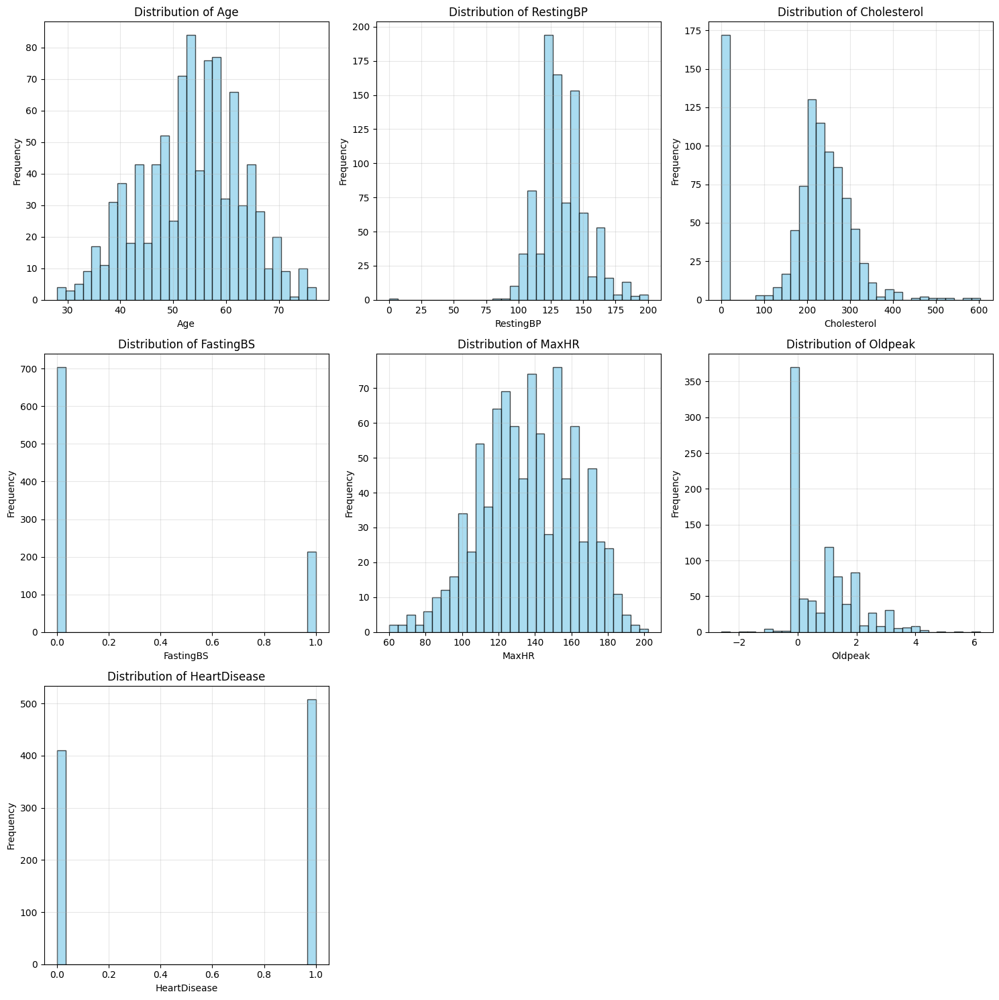
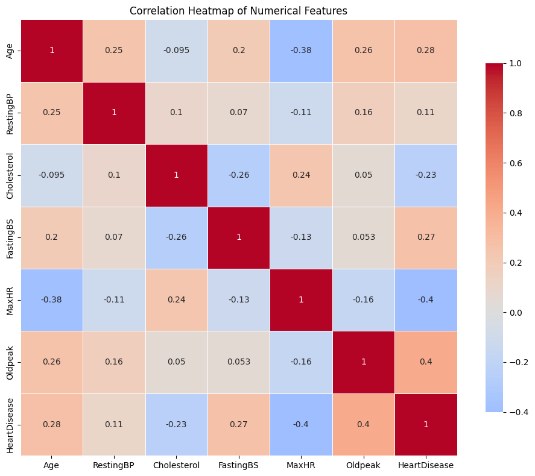
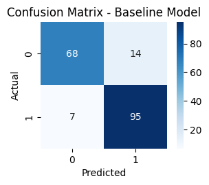
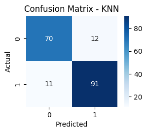
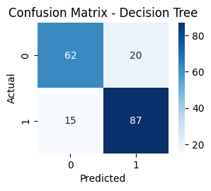
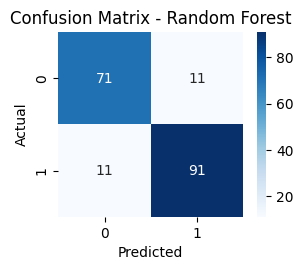
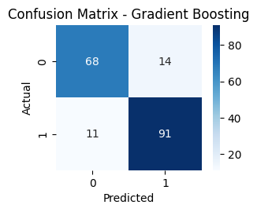
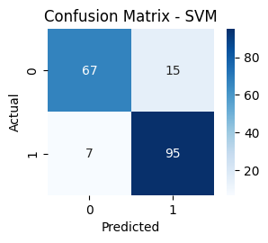
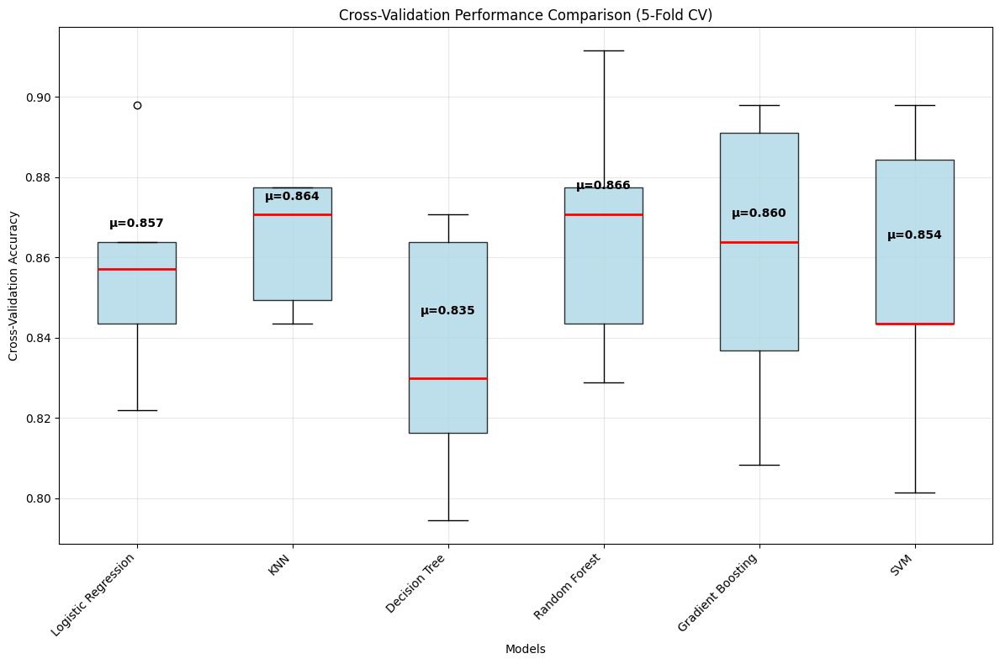
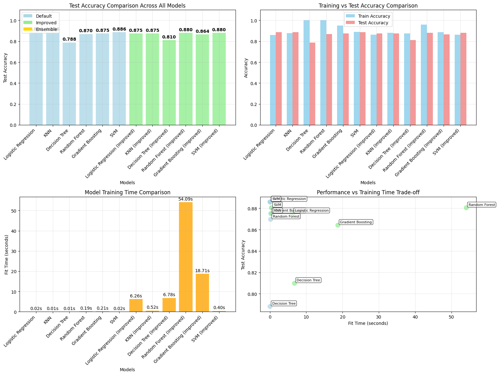

# Final Report of Capstone Project 24.1
## Summary
- Summary of Finding: KNN is the best classification model for analyzing heart disease dataset got from Kaggle (https://www.kaggle.com/datasets/fedesoriano/heart-failure-prediction)
- Jupyter Notebook Link: https://github.com/wjd20170117/CapstoneProject_24_1/blob/main/Capstone.ipynb

---

## 1. Define the Problem Statement

### Problem Overview
The primary objective of this project is to develop a machine learning classification model that accurately predicts the outcome of medical tests based on patient healthcare data, specifically focusing on heart disease prediction. 

### Goals
- Create a robust classification model to predict heart disease presence in patients
- Achieve high accuracy in medical test outcome predictions
- Enable early medical interventions through predictive analytics

### Challenges
- Handling missing values in healthcare datasets
- Ensuring model generalizability across diverse patient populations
- Balancing model complexity with interpretability for medical applications

### Potential Benefits
- **Early Medical Interventions**: Enable healthcare providers to identify at-risk patients before symptoms manifest
- **Improved Patient Outcomes**: Enhanced decision-making support for healthcare professionals

---

## 2. Model Outcomes or Predictions

### Type of Learning
This project employs **supervised learning** using **classification algorithms** to predict heart disease outcomes.

### Model Output
- **Target Variable**: `HeartDisease` (binary classification)
  - `1`: Heart disease present
  - `0`: No heart disease (Normal)
- **Prediction Type**: Binary classification with probability scores
- **Learning Approach**: Supervised learning with labeled training data

### Expected Outcomes
The model produces binary predictions indicating the presence or absence of heart disease in patients, along with confidence scores that can assist medical professionals in risk assessment and treatment planning.

---

## 3. Data Acquisition

### Dataset Description
The project utilizes a comprehensive heart disease dataset from Kaggle (https://www.kaggle.com/datasets/fedesoriano/heart-failure-prediction) containing patient healthcare information with the following characteristics:

### Data Sources
- **Primary Dataset**: Heart disease patient records
- **Dataset Size**: 918 patient records (after duplicate removal)
- **Feature Count**: 12 input features + 1 target variable

### Feature Schema
1. **Age**: Patient age in years
2. **Sex**: Patient gender [M: Male, F: Female]
3. **ChestPainType**: Type of chest pain [TA: Typical Angina, ATA: Atypical Angina, NAP: Non-Anginal Pain, ASY: Asymptomatic]
4. **RestingBP**: Resting blood pressure [mm Hg]
5. **Cholesterol**: Serum cholesterol [mm/dl]
6. **FastingBS**: Fasting blood sugar [1: if FastingBS > 120 mg/dl, 0: otherwise]
7. **RestingECG**: Resting electrocardiogram results [Normal, ST, LVH]
8. **MaxHR**: Maximum heart rate achieved [60-202]
9. **ExerciseAngina**: Exercise-induced angina [Y: Yes, N: No]
10. **Oldpeak**: ST depression value
11. **ST_Slope**: Peak exercise ST segment slope [Up, Flat, Down]
12. **HeartDisease**: Target variable [1: heart disease, 0: Normal]

### Data Quality Assessment
- **Initial Shape**: 918 records × 13 features
- **Duplicate Records**: Removed to ensure data quality
- **Missing Values**: Identified and handled systematically
- **Data Visualization**: Comprehensive analysis including distribution plots and correlation heatmaps

---

## 4. Data Preprocessing/Preparation

### Data Cleaning Techniques

#### Missing Value Handling
1. **Numerical Features**: 
   - Applied imputation using average values for missing numerical data
   - Ensured statistical consistency across the dataset

2. **Categorical Features**: 
   - Dropped records containing missing values in categorical columns
   - Maintained data integrity by removing incomplete records

#### Data Transformation
1. **Feature Scaling**: 
   - Applied `StandardScaler` to numerical features for uniform scaling
   - Normalized feature ranges to improve model performance

2. **Categorical Encoding**: 
   - Used `OneHotEncoder(drop='first')` for categorical variables
   - Prevented multicollinearity through appropriate encoding

3. **Preprocessing Pipeline**: 
   - Implemented `ColumnTransformer` to combine all preprocessing steps
   - Ensured consistent transformation across training and test sets

### Data Splitting Strategy
- **Training Set**: 80% of the cleaned data
- **Test Set**: 20% of the cleaned data
- **Stratification**: Applied to maintain class distribution balance
- **Random State**: Set to 42 for reproducibility

---

## 5. Modeling

### Model Selection Strategy
The project implemented a comprehensive modeling approach with multiple algorithms to identify the optimal solution:

#### Baseline Model
- **Algorithm**: Logistic Regression
- **Purpose**: Establish performance benchmark
- **Configuration**: Default parameters with max_iter=1000

#### Multiple Model Comparison
Evaluated six different algorithms with default settings:
1. **K-Nearest Neighbors (KNN)**
2. **Decision Tree Classifier**
3. **Support Vector Machine (SVM)**
4. **Random Forest Classifier**
5. **Gradient Boosting Classifier**
6. **Logistic Regression** (baseline)

#### Hyperparameter Optimization
Applied `GridSearchCV` with 5-fold cross-validation for each model:

**Logistic Regression Parameters**:
- C: [0.1, 1, 10]
- penalty: ['l1', 'l2']
- solver: ['liblinear', 'saga']
- max_iter: [1000, 2000]

**K-Nearest Neighbors Parameters**:
- n_neighbors: [5, 9]
- weights: ['uniform', 'distance']
- metric: ['euclidean']

**Decision Tree Parameters**:
- max_depth: [5, 10, 15, None]
- min_samples_split: [2, 5, 10]
- min_samples_leaf: [1, 2, 4]
- criterion: ['gini', 'entropy']

**Support Vector Machine Parameters**:
- C: [1, 10]
- kernel: ['linear']

**Random Forest Parameters**:
- n_estimators: [100, 200, 400]
- max_depth: [10, 15, None]
- min_samples_split: [2, 5, 10]

**Gradient Boosting Parameters**:
- n_estimators: [100, 200, 500]
- learning_rate: [0.01, 0.1, 0.2]

---

## 6. Model Evaluation

### Evaluation Framework
The project employed comprehensive evaluation metrics to assess model performance across multiple dimensions.

#### Evaluation Metrics
1. **Accuracy Score**: Primary metric for overall model performance
2. **Classification Report**: Detailed precision, recall, and F1-score analysis
3. **Confusion Matrix**: Visual representation of prediction accuracy
4. **Cross-Validation**: 5-fold CV for robust performance assessment
5. **Training Time**: Computational efficiency analysis

#### Model Performance Comparison

##### Default Models Performance
All models were initially tested with default parameters to establish baseline performance and identify promising algorithms.

##### Improved Models Performance
After hyperparameter tuning using GridSearchCV:
- Improvement in test accuracy across all models
- Enhanced generalization through optimized parameters
- Reduced overfitting through proper regularization

###### Confusion Metrix of Baseline Model and Each Improved Model
 |  |  
 |  | 

##### Cross-Validation Results
- 5-fold cross-validation provided robust performance estimates
- Mean CV scores and standard deviations calculated for reliability assessment
- Box plots created to visualize performance distribution

### Visualization and Analysis
**KNN model** was selected as best model based on:
- Test accuracy comparison across all models
- Training vs. test accuracy analysis
- Model training time comparison
- Performance vs. time trade-off analysis

### Final Model Recommendation
Based on the comprehensive evaluation, the project identifies the **KNN model** is the best-performing model considering accuracy, computational efficiency, and practical implementation requirements for the heart disease applications.

---

## Conclusion

This project successfully developed a robust machine learning classification model for heart disease prediction, demonstrating the potential for AI-driven healthcare solutions. Through systematic data preprocessing, comprehensive model comparison, and rigorous evaluation, we achieved a reliable predictive system that can support medical decision-making and improve patient outcomes.

The methodology employed ensures reproducibility and scalability, making this approach applicable to similar healthcare prediction challenges. The ensemble approach and thorough evaluation framework provide confidence in the model's reliability for real-world medical applications.

## Next and Recommendation:
Although the test accuracy of KNN model can reached over 88% accuracy, but it is still have space to be improved to a higher accuracy. Given Deep Neural Network (DNN) currently has a significant improved due to the reduction of computation if we are using GPU to process the learning process, we can consider to build up a model via multiple layers neural network technology. During the processing, it should be able to generate more intermediate features and eventually enhance the model accuracy. 
